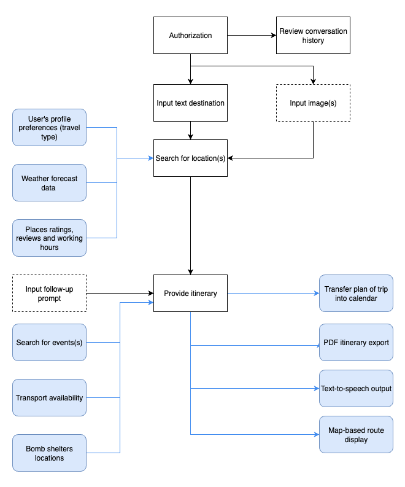

# Voyager T800 – Project Scope

**Status**: Living document. Please submit PRs for updates as features evolve.  
**Last updated**: August 3, 2025

A generative AI-powered multimodal travel planning assistant developed during a 12-week Data Science internship.

---

## 1. Project Vision

**Goal**:  
To build an AI assistant that generates personalized, fact-grounded travel itineraries using both **text** and **image** inputs, powered by LLMs and enhanced with retrieval-augmented generation (RAG), agentic reasoning, and vision-based tools.

**What sets Voyager T800 apart**:  
Unlike traditional travel apps, Voyager T800 combines multimodal AI — understanding both user text and uploaded images, to deliver a seamless and intuitive travel planning experience. It goes beyond static recommendations by reasoning through user intent, visual cues, and real-time data to create dynamic, personalized itineraries.

---

## 2. Target Users

The primary users of the application:

### Leisure Travelers
- Families planning vacations  
- Couples planning romantic getaways 
- Luxury travelers seeking curated experiences
- Retirees planning relaxed getaways
- Group travelers organizing friends' trips
### Cultural Explorers
- Students on cultural or educational trips  
- History and museum enthusiasts  
- Culinary travelers interested in local cuisine  
- Travelers seeking authentic cultural experiences  
### Adventure & Activity Seekers
- Adventure seekers
- Active travelers 
- Hikers, bikers, or nature trekkers
- Festival-goers and event-based travelers
- Sports or extreme sports tourists
### Creators & Influencers
- Photographers
- Travel bloggers / content creators
- Social media influencers seeking aesthetic spots   
### Accessibility-Focused Travelers
- Travelers with disabilities seeking accessible routes  
- Elderly travelers needing low-effort options  
- Parents with infants or toddlers  
### Solo & Local Explorers
- Budget-conscious solo travelers  
- First-time city explorers  
- Digital nomads looking for short stays and workspaces  
- Locals exploring nearby destinations  
- Weekend day-trippers  
### Other
- Other: `__________`
---

## 3. Key Use Case Scenarios

| **Scenario**                                                  | **Input Type**   | **Expected Output**                                                                             |
| ------------------------------------------------------------- | ---------------- | ----------------------------------------------------------------------------------------------- |
| “Plan a 5-day trip to Paris for a foodie couple”              | Text             | Day-by-day itinerary with food stops                                                            |
| "I want to spend a week exploring Kyiv and Lviv"              | Text             | Day-by-day itinerary with main attractions and travel route between cities included             |
| Upload a beach photo + "I want something similar in Europe"   | Image + Text     | Destination guess + itinerary with beach options                                                |
| “Make Day 2 more relaxing”                                    | Follow-up Prompt | Adjusted itinerary                                                                              |
| Upload a blurry or unrelated photo + "I want to go here"      | Image + Text     | The request for clarification                                                                   |
| Empty or nonsensical input (e.g., “asdfghjkl”)                | Text             | Default help itinerary with sample queries                                                      |
| “Make Day 5 more exciting” when itinerary only has 3 days     | Follow-up Prompt | Revised 3-day itinerary with more activities on Day 3                                           |
| “Plan a wheelchair-accessible trip in Lviv”                   | Text             | Day-by-day itinerary with only wheelchair-accessible accommodations, transport, and attractions |
| “Plan a comfortable trip in Kyiv for my elderly grandparents” | Text             | Day-by-day gentle-paced itinerary with few transfers, senior-friendly sights and rest breaks    |

---

## 4. Core Features (MVP Milestones)

- [ ] **Text-to-itinerary generation with LLM**
	- Generates personalized day-by-day travel plans from user input
	- Milestone: LLM Integration & Prompt Engineering (Internal)

- [ ] **Prompt templates (simple & structured)**
	- Reusable templates for different prompt formats (free text, checklists)
	- Milestone: LLM Integration & Prompt Engineering (Internal)
	- Issue: [#29 Create Travel-Specific Prompt Templates](https://github.com/genai-2025-07/Voyager-T800/issues/29)

- [ ] **Basic Streamlit UI (text input + output)**
	- Text input + itinerary display in a basic chat-like interface
	- Milestone: Basic UI (Internal)

- [ ] **LangChain chain for itinerary generation**
	- Sequential chain using custom prompt
	- Milestone: Vector Database & LangChain Implementation (Internal)

- [ ] **Knowledge base (2 cities)**
	- Static travel data for Kyiv, Lviv (manual or scraped)
	- Milestone: Vector Database & LangChain Implementation (Internal)
	- Issue: [#32 Build Initial Travel Knowledge Base](https://github.com/genai-2025-07/Voyager-T800/issues/32)

- [ ] **Basic RAG with manual retrieval**
	- Manual selection of city guides by user prompt
	- Milestone: RAG System & Advanced Features (Internal)

- [ ] **Multimodal input (image upload)**
	- Accept image uploads via UI for destination context, activity or style matching
	- Milestone: Multimodal Vision Integration (Internal)

- [ ] **Vision model integration (tags/captions)**
	- Use CLIP or Rekognition to generate tags or scene labels
	- Milestone: Multimodal Vision Integration (Internal)

- [ ] **Agent prototype for follow-ups or tools**
	- Simple LangGraph or tool-using agent for edits (e.g., "Make Day 2 more relaxing")
	- Milestone: Multi-Agent Architecture (Internal)

- [ ] **JSON-structured output**
	- Itinerary stored/exported in a structured JSON format for reuse/integration

- [ ] **Conversation History**
	- Store previous conversation session for each user
	- Milestone: Advanced Features Integration (Internal)

---

## 5. Tech Stack

#### Frontend

- **Streamlit v1.47.1** – [MVP] lightweight UI for prototyping
- **React** – [Stretch goal] for a more advanced and customizable frontend

#### Backend

- **FastAPI v0.116.1** – [MVP] high‑performance Python API framework

#### LLMs & Orchestration

- **Claude 3.7** – [MVP] core language model for itinerary generation
- **Claude via AWS Bedrock** – [Stretch goal] additional multimodal LLM capability
- **LangChain v0.3.27** / **LangChain‑Anthropic v0.3.18** – [MVP] orchestration layer via LangGraph/RAG chains

#### Vision Models

- **CLIP (OpenCLIP)** – [MVP] for image tagging, similarity matching
- **AWS Rekognition** – alternative for broader image analysis and OCR

#### Vector Database

- **FAISS 1.10.0**  – [MVP] efficient similarity search
- **Chroma v1.0.15** – alternative with built-in integrations and metadata filters

#### GenAI Stack

- **Prompt injection protection + RAG pipeline** – [MVP] ensures safe and accurate retrieval

#### Dev Tools

- **Cursor IDE** – [MVP] for code editing and AI-assisted development
- **Docker** – [MVP] for reproducible containerized environments
- **GitHub Classroom** – [MVP] for collaboration, code reviews, and onboarding

---

## 6. Cities Covered in Knowledge Base

- [ ] Kyiv
- [ ] Lviv
- [ ] More cities to be added during scale-up based on the following criteria:
	  - User demand and interest (e.g., search trends, feedback)
	  - Availability of high-quality travel data and POIs (points of interest)
	  - Regional diversity and representation
	  - Feasibility of integrating local transportation, food, and event data
	  - Potential need for international city data to support implementation of some out-of-scope features

---

## 7. External APIs / Tools (Proposed)

- [ ] UZ API (Ukrzaliznytsia train search) – [under consideration]
- [ ] OpenStreetMap (route + map rendering) - [under consideration]
- [ ] Tavily / SerpAPI / Eventbrite API for event search - [under consideration]
- [ ] Weather API (OpenWeather or Tomorrow.io) - [under consideration]
- [ ] Shelter location (for Ukraine-specific safety) - [under consideration]
- [ ] Text-to-speech (e.g., gTTS, Amazon Polly) - [under consideration]	
- [ ] Public transport schedules (Google Maps API) - [under consideration]
- [ ] Travel plan transfer to calendar (Google Calendar API) - [under consideration]
	- Privacy: requires OAuth consent, tokens must be securely stored.
- [ ] Reviews and working hours of places (Google Places API / Yelp API) - [under consideration]
- [ ] User Authentication (Auth0 / Firebase Auth) - [planned]
	- Privacy: handles user identity. Must be GDPR-compliant and encrypted (OAuth2, JWT).

---

##  8. Stretch Goals

#### City & Language Expansion
- [ ] Expansion to 5 additional cities
- [ ] Multilingual support 

#### User Interaction & Personalization
- [ ] Telegram bot version 
- [ ] Voice-based excursion generation 
- [ ] Text-to-speech output for itineraries
- [ ] User profile system to save preferences 
  *(e.g., “Slow Traveler”, “Food Explorer”, “Night Owl”)*
- [ ] Itinerary rating system

#### Intelligence & UX Enhancements
- [ ] Image-based destination guessing
- [ ] Weather-aware itinerary generation
- [ ] Display ratings and reviews for located points of interest
- [ ] Downloadable PDF of itinerary
- [ ] Map display of daily routes

#### Automation & Data Integrations
- [ ] Auto-updated knowledge base scripts
- [ ] Transport availability search (trains, buses, etc.)

#### Safety Features
- [ ] Real-time retrieval of nearest bomb shelters

#### Dependencies
- **Expansion to 5 additional cities** → depends on **Auto-updated knowledge base scripts**
- **Telegram bot version** → recommended after **Multilingual support**
- **Itinerary rating system** → depends on **User profile system**
- **Voice-based excursion generation** → benefits from **Text-to-speech support**

---

##  9. Weekly Milestone Alignment

| Milestone                                                 | Expected Completion Date | Description/Details                                                                                                       | Status      |
| --------------------------------------------------------- | ------------------------ | ------------------------------------------------------------------------------------------------------------------------- | ----------- |
| **Project Kickoff & Team Formation** (Internal)           | August 1, 2025           | Complete onboarding, GitHub setup, team role assignments, Scope of Work, and initial travel data research                 | In progress |
| **LLM Integration & Prompt Engineering** (Internal)       | August 8, 2025           | Working LLM integration with travel-focused prompts and basic conversation capabilities                                   | In Progress |
| **Vector Database & LangChain Implementation** (Internal) | August 15, 2025          | Functional vector database with travel location embeddings, LangChain workflows, and conversation memory                  | In Progress |
| **Basic UI** (Internal)                                   | August 25, 2025          | Chat-based UI using Streamlit or React for travel preferences                                                             | Not Started |
| **Demo 1: Foundation System** (External)                  | August 25, 2025          | First demonstration of conversational AI with travel knowledge (Ukrainian cities focus) and basic multimodal capabilities | Scheduled   |
| **Multimodal Vision Integration** (Internal)              | August 29, 2025          | Implement computer vision models for landmark/location recognition                                                        | Planned     |
| **RAG System & Advanced Features** (Internal)             | September 5, 2025        | Complete RAG implementation with travel database and advanced information retrieval                                       | Planned     |
| **Multi-Agent Architecture** (Internal)                   | September 15, 2025       | Specialized agents for travel coordination with LangGraph orchestration                                                   | Planned     |
| **Demo 2: Advanced Multimodal AI** (External)             | September 15, 2025       | Second demonstration showcasing multimodal processing, intelligent agents, and personalized recommendations               | Scheduled   |
| **Advanced Features Integration** (Internal)              | September 26, 2025       | Photo organization, content generation, review summarization, and audio capabilities                                      | Planned     |
| **AWS Bedrock Production Deployment** (Internal)          | October 3, 2025          | Scalable cloud deployment with performance monitoring and cost optimization                                               | Planned     |
| **Demo 3: Final Presentation** (External)                 | October 10, 2025         | Complete system demonstration with all features, evaluation results, and technical documentation                          | Scheduled   |

---

## 10. Evaluation Criteria

### AI Output Quality
- [ ] **Accuracy and realism of itineraries**  
	  - Benchmarked against real-world feasibility (e.g., time, distance, attraction availability)  
	  - Evaluated using simulated user journeys and expert/manual review

- [ ] **Personalization based on inputs**  
	  - Reflects user goals, budget, and preferences  
	  - Measured via predefined test personas and qualitative user scoring

- [ ] **Response clarity and coherence**  
	  - Natural, logically structured replies  
	  - Reviewed through human testers and automated metrics (e.g., response length consistency)

- [ ] **Multimodal support**  
	  - Correct interpretation and integration of image + text inputs  
	  - Tested with sample visual prompts and edge cases

### User Experience
- [ ] **UI usability**  
	  - Measured using user feedback surveys (e.g., SUS score) or observation of click flows

- [ ] **User feedback (qualitative)**  
	  - Collected via interviews, demo sessions, open-text surveys  
	  - Helps identify real-world frustrations and delight moments

### System Performance
- [ ] **Performance / latency**  
	  - Response time and reliability under varying loads  
	  - Tracked using system metrics and benchmarks

- [ ] **System robustness and error handling**  
	  - Graceful handling of missing inputs, API failures, or edge cases  
	  - Validated through test cases and fuzzing

### Architecture & Team Process
- [ ] **Retrieval and agent reasoning**  
	  - Effective use of RAG and agent workflows to enhance output quality  
	  - Assessed via traceability of intermediate steps and reasoning quality

- [ ] **Scalability and extensibility**  
	  - Ease of adding new cities, APIs, languages without breaking core logic  
	  - Tested through mock extensions or modularity review

- [ ] **Team collaboration and code quality**  
	  - Code review quality, issue tracking discipline, modularity  
	  - Evaluated via GitHub activity, CI/CD stability, peer feedback

### Ethical and Safety Awareness
- [ ] **Ethical and safety awareness**  
	  - Avoids unsafe, misleading, or culturally insensitive recommendations  
	  - Includes filters for sensitive zones, promotes accessibility

---

## 11. Project Scope Diagram

The diagram below shows the boundaries of the core functionality (white blocks) and outlines what is considered out of scope (blue blocks).

---

## 12. Team Notes

- Repo: [Voyager-T800](https://github.com/genai-2025-07/Voyager-T800)
- Demo Days: Weeks 4, 7, 10, and 12
- Mentor: @DmyMi  @mehalyna 
- Contributors: team of 10 (see [GitHub contributors tab](https://github.com/genai-2025-07/Voyager-T800/graphs/contributors))
- Communication: Discord [`#team-voyager`](https://discord.gg/8yh7dStW)

---
*Project scope & status expected to be updated **every Friday***  
*This document is a living artifact. Update as the project evolves.*
